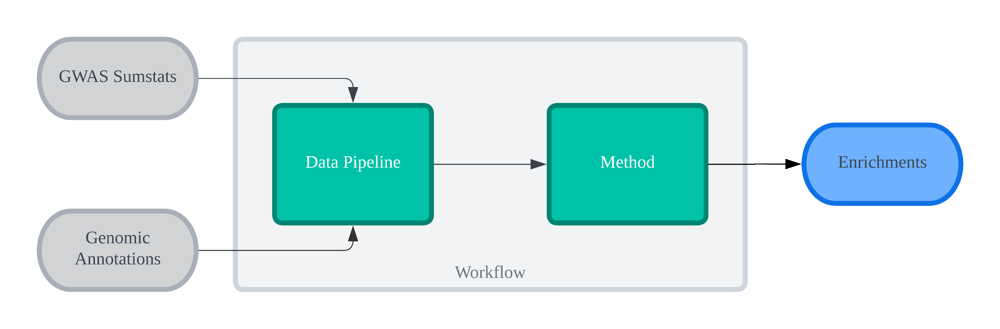

# funkea

Perform functional enrichment analysis at scale.

## Install

`funkea` is available on PyPI, and can be installed using `pip`:

```shell
pip install funkea
# OR
pip install 'funkea[jax]'  # optional JAX dependency -- enables LDSC on GPU
```

If you want to build from source, you can clone the repository and install using:

```shell
git clone https://github.com/BenevolentAI/funkea
cd funkea
pip install .
```

Note that `funkea` requires Python 3.10 or higher, and that it uses Scala for some of its
user-defined functions. The above command will fail if you do not have a Scala compiler installed,
or if it is not on your path. If you do not have a Scala compiler installed, you can install one
from [here](https://www.scala-lang.org/download/) (version 2.12.x). Note that the Scala installer
can sometimes have issues adding the compiler to your path, so you may need to do this manually.

## Quickstart

`funkea` was built with composability in mind, but also ships with 5 popular enrichment methods out
of the box. The simplest and fastest method is a Fisher's exact test on the overlapped annotations:

```python
from funkea.implementations import Fisher
from pyspark.sql import DataFrame

sumstats: DataFrame = ...  # your GWAS sumstats

# perform tissue enrichment using GTEx data
model = Fisher.default()
enrichment = model.transform(sumstats)
```

This assumes that the default filepaths are set in the [file-registry](#setting-default-filepaths).
If you have not set the file-registry, you can pass the filepaths directly to the data components:

```python
from funkea.implementations import Fisher
from funkea.core import data
from pyspark.sql import DataFrame

sumstats: DataFrame = ...  # your GWAS sumstats

# define your annotation component
annotation = data.AnnotationComponent(
    # the column names in annotation dataframe
    columns=data.AnnotationColumns(
        annotation_id="gene_id",
        partition_id="tissue_id",
    ),
    # the path to the GTEx dataset (needs to be in parquet format)
    dataset="path/to/gtex_dataset.parquet",
    # the type of partitioning used in the annotation dataset
    # (either data.PartitionType.SOFT or data.PartitionType.HARD)
    # see docs for more information
    partition_type=data.PartitionType.SOFT,
)

# perform tissue enrichment using GTEx data
model = Fisher.default(annotation=annotation)
```

The `dataset` can also be passed as a `DataFrame` directly, if you have already loaded it into your
Spark session.

```python
from funkea.core import data
from pyspark.sql import DataFrame, SparkSession

# load the GTEx dataset
spark: SparkSession = ...  # your Spark session
gtex: DataFrame = spark.read.parquet("path/to/gtex_dataset.parquet")

# define your annotation component
annotation = data.AnnotationComponent(
    columns=data.AnnotationColumns(
        annotation_id="gene_id",
        partition_id="tissue_id",
    ),
    # the GTEx dataset
    dataset=gtex,  # <-- pass the DataFrame directly
    partition_type=data.PartitionType.SOFT,
)
```

It is generally recommended to set the file-paths using the
[file-registry](#setting-default-filepaths), as it is easy to forget to pass the filepaths to all
the components. The above example is simple, where there is only one required data source (barring
the GWAS sumstats), but more complex methods may require multiple data sources. For example, the
`GARFIELD` method requires linkage disequilibrium (LD) estimates, variant-level controlling
covariates, and the annotation component.

## Introduction

`funkea` is a Python library for large-scale functional enrichment analysis. It provides 5 popular
enrichment methods, and also allows for experimentation by composing different components. It is
written in Spark, and allows users to run an arbitrary number of GWAS studies concurrently, given
the resources are available. It also provides a CLI for managing data sources.

`funkea` has a few concepts used for abstraction, such that all methods could be unified. A view of
the schematic is outlined below



i.e. each workflow consists of (1) a data pipeline; and (2) an enrichment method. The former filters
down the sumstats (`variant_selection`), creates loci from the remaining variants
(`locus_definition`) and then finally associates these loci with annotations (`annotation`). The
latter then takes the loci (including their annotations) and computes the study-wide enrichments
for each annotation partition, and its respective significance.

The variant selection and locus definitions are composed by the user, but each of the enrichment
methods provided by `funkea` provide default configurations. The user can also define their own
annotation component, which is required for all enrichment methods.

## Setting default filepaths

For ease of use, `funkea` uses a file-registry for its source of truth of various data sources. These
need to be set by a user, which can be set easily by using the `funkea-cli`. For example, if the
user has put all the data into a single directory, the registry can be set like so:

```shell
funkea-cli init --from-stem <PATH_TO_DATASET>
```

This will set the default filepaths for all the data sources, where the filenames will be the key
in JSON object. For example, if the user has put all the data into `/path/to/data`, the registry
will look like:

```json
{
  "gtex": "/path/to/data/gtex",
  "ld_reference_data": "/path/to/data/ld_reference_data",
  "depict_null_loci": "/path/to/data/depict_null_loci",
  "chromosomes": "/path/to/data/chromosomes",
  "snpsea_background_variants": "/path/to/data/snpsea_background_variants",
  "garfield_control_covariates": "/path/to/data/garfield_control_covariates",
  "ldsc_controlling_ld_scores": "/path/to/data/ldsc_controlling_ld_scores",
  "ldsc_weighting_ld_scores": "/path/to/data/ldsc_weighting_ld_scores"
}
```

The filepaths can also be set individually using the `funkea-cli`:

```shell
funkea-cli init
```

This will start an interactive prompt, where the user can set the filepaths individually. The
registry can also be edited manually at
`funkea/core/resources/file_registry.json`, but it is recommended to use the CLI, as it can be
difficult to find the registry file.

Alternatively, the file paths can be specified directly in the components
(see [quickstart](#quickstart)). It is generally recommended to use the CLI, as it is easy to forget
to pass the filepaths to all the components, especially for enrichment methods which require
multiple data sources (LD data, controlling covariates etc.).

## Testing

`funkea` uses `pytest` for testing. To run the tests, run the following command from the root
directory:

```shell
make test
```

This will install most dependencies if they are not present, except the Java runtime, as this
depends heavily on the user's system. Make sure to install this yourself first before running the
tests.

Note: some tests will be skipped on Linux systems with Aarch64 architecture, as JAX does not support
this architecture. This is a known issue, and will (hopefully) be fixed in the future (see
[here](https://github.com/google/jax/issues/7097)).

## Documentation

The documentation is hosted on [readthedocs](https://funkea.readthedocs.io/en/latest/). It is
automatically built from the `docs` directory in the `main` branch. To build the documentation
locally, run the following command from the root directory:

```shell
make docs
```
